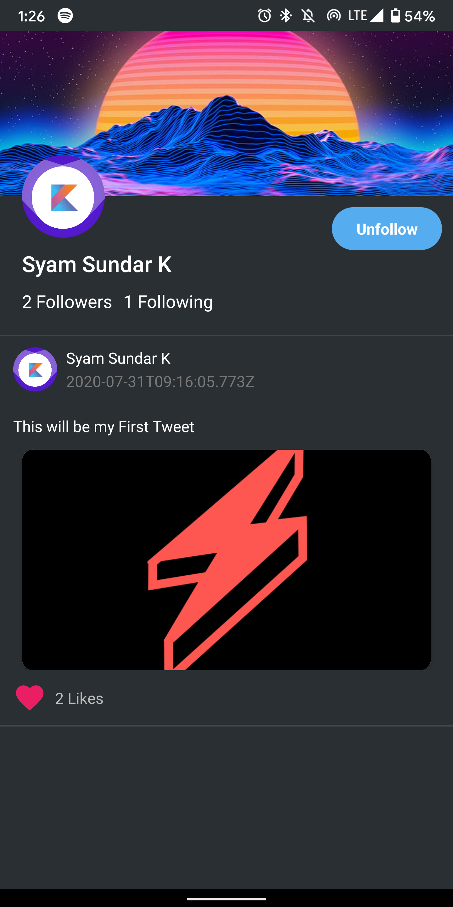
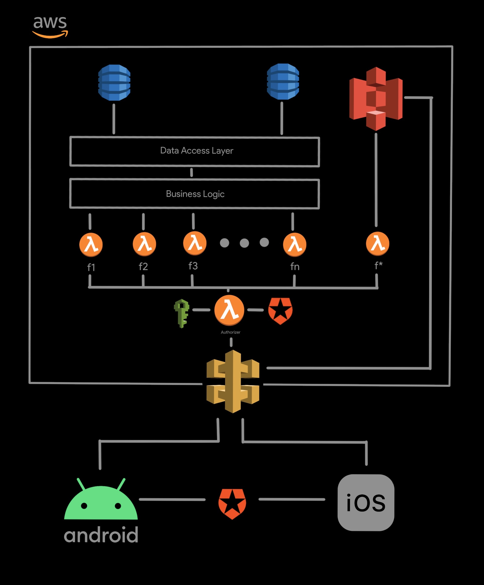

  

### Description
This repository contains code that helps you build a twitter clone and helps you deploy it to cloud as FaaS .i.e., Serverless Twitter. Take a look at [setup.md](https://github.com/SyamSundarKirubakaran/serverless-twitter/blob/master/docs/setup.md) to learn how to setup this project. You can also find two mobile clients consuming these serverless APIs .i.e., **Android**(v0.5) and **iOS**(WIP).

### Functions

- **POST** - Create User 
    - `https://{{apiId}}.execute-api.us-east-1.amazonaws.com/dev/user`
- **POST** - Create Tweet 
    -  `https://{{apiId}}.execute-api.us-east-1.amazonaws.com/dev/tweet`
- **GET** - Get All Tweets 
    -  `https://{{apiId}}.execute-api.us-east-1.amazonaws.com/dev/tweet`
- **GET** - Get Tweets by Specific User 
    -  `https://{{apiId}}.execute-api.us-east-1.amazonaws.com/dev/tweet/specific/{authType}/{userId}`
- **PATCH** - Like / Unlike a Tweet 
    -  `https://{{apiId}}.execute-api.us-east-1.amazonaws.com/dev/tweet/{tweetId}`
- **PATCH** - Follow / Unfollow a Tweet 
    -  `https://{{apiId}}.execute-api.us-east-1.amazonaws.com/dev/user`
- **GET** - Get All Users 
    -  `https://{{apiId}}.execute-api.us-east-1.amazonaws.com/dev/user`
- **GET** - Get Specific User 
    -  `https://{{apiId}}.execute-api.us-east-1.amazonaws.com/dev/user/specific/{authType}/{userId}`
- **DELETE** - Delete Tweet 
    -  `https://{{apiId}}.execute-api.us-east-1.amazonaws.com/dev/tweet/{tweetId}`
- **GET** - Get Signed URL for Image Upload 
    -  `https://{{apiId}}.execute-api.us-east-1.amazonaws.com/dev/tweet/signedUrl/{tweetId}`

You can also import the provided Postman Collection to take a quick look at the exposed endpoints. Also make sure to fill up `apiId` and `authToken` environment variables to make endpoints intract with the deplpoyed serverless application.

### Architecture

  

