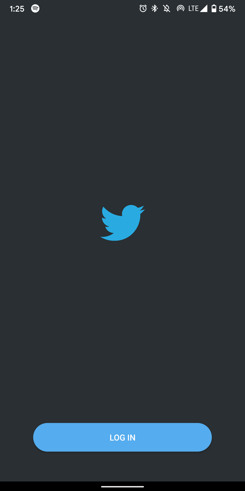
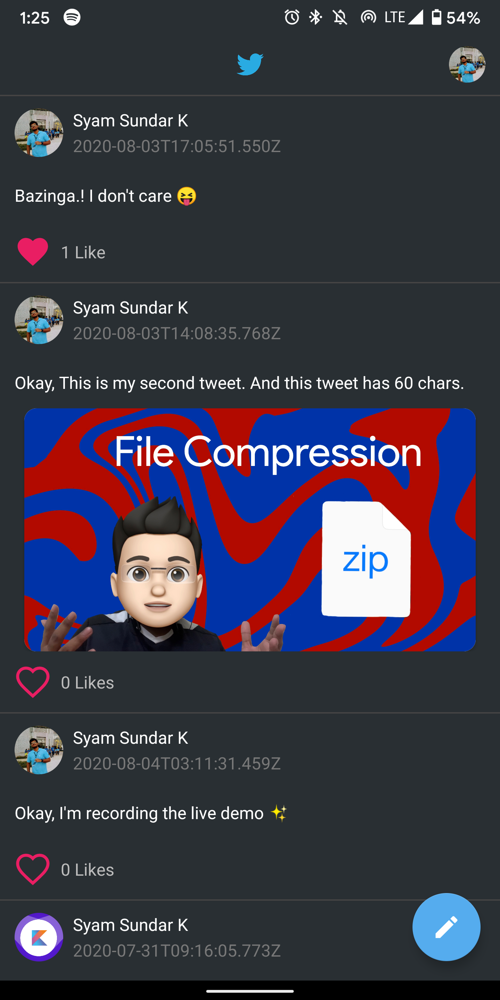
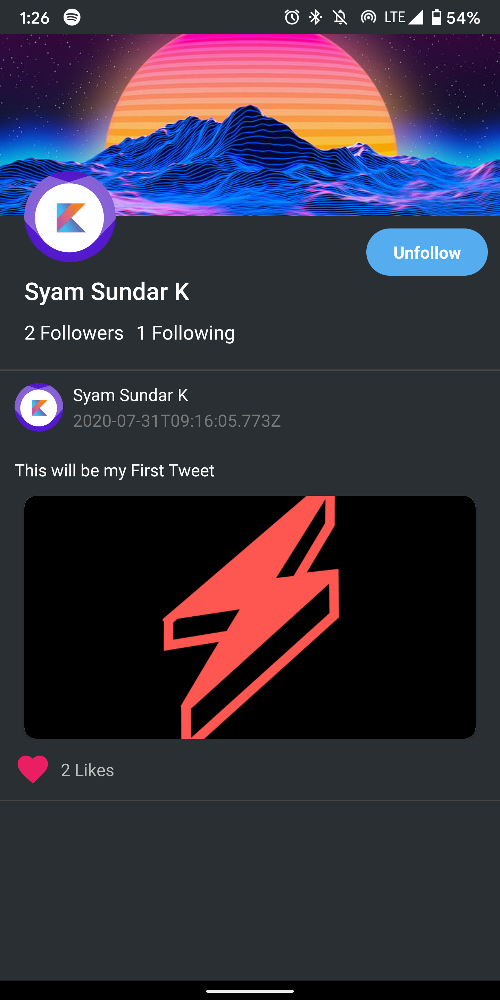

# Authentication Setup
- You'll have to create an account in Auth0, if you haven't already. Also create an Application in Auth0 dashboard that can authenticate mobile clients.
- Notice that we'll be using RS256 Algorithm for Auth.

# Backend Setup
- Create a free tier account on AWS, if you haven't already.
- Open `backend` directory in VScode or any code editor of your preference.
- Install npm dependencies for the backend project.
```
    $ npm install
```
- Install serverless framework in your development machine.
```
    $ npm install serverless -g
```
- Set `cert` with the Certificate that you obtained through Auth0 app that you just created. You can find the `certificate` under,
```
    Auth0 Application -> Show Advanced Settings -> Certificate Tab -> Copy Certificate -> Paste it as cert variable
``` 
- Make sure you have AWS credentials setup in your terminal so that you can push the serverless application directly to AWS.
```
    $ sls deploy -v
```

# Android Setup
- Open `android` directory in Android Studio.
- Open the application that you just created in Auth0. Update `Allowed Callback URLs` section with,
```
    demo://{{auth0_domain}}/android/app.syam.twitter/callback
```
- Make sure to replace `auth0_domain` with your Auth0 domain, that you got when you created the Auth0 App.
- Update `strings.xml` in `res` directory of the android app.
```
    Set `com_auth0_client_id` to `Client ID` from the App created in Auth0
    Set `com_auth0_domain` to `Domain` from the App created in Auth0
```

**Screenshots**<br />




# iOS Setup
- :warning: Work In Progress :warning:
